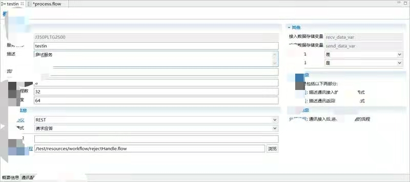
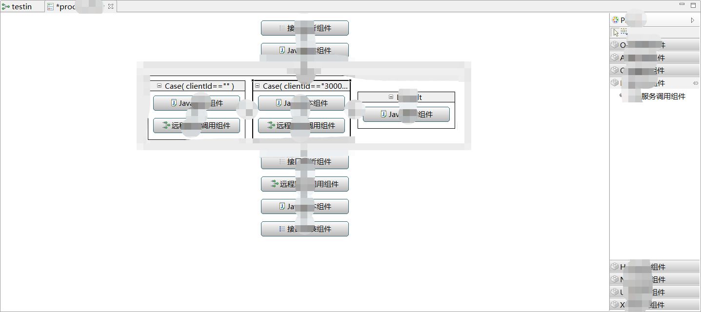
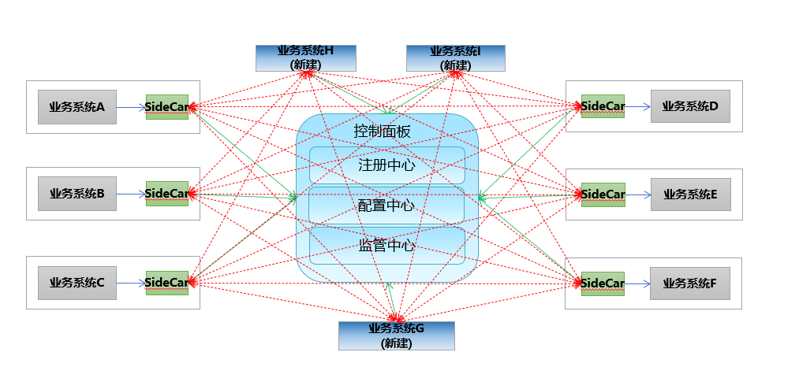

# commander

Commander 是一个用途广泛的低代码开发平台。支持Orchestration和Choreography两种模式的服务编排，也可用作传统业务的整合平台，开放API网关系统，亦可作为 Service Mesh 架构的边车，将存量系统接入微服务架构。

Commander 由IDE和运行时两部分构成。IDE提供所见即所得的服务定义（接入接出通讯配置，接口配置）和处理流程，是一个基于Eclipse的低代码开发平台，服务端可以嵌入式使用，也提供独立部署包。

服务编排是对基础的业务服务按照一定的业务规则进行逻辑组合，然后提供一个封装后的组合服务接口给前端的过程。

#### 功能
- 可视化组合服务定义，包括服务Url，流控标识，熔断标识，请求接口，响应接口，处理流程等；

- 可视化流程编排：对于服务处理流程的节点组件，控制模型的属性进行可视化设置；

 

- 流程控制模型（顺序、分支、循环、异常抛出、并行）；

- 丰富的业务流程处理组件。包括接口解析拼装组件，变量处理脚本组件，服务调用组件等；提供自定义组件接口可方便自行扩展;

- 支持分布式事务能力，在服务调用失败时可以进行补偿或回滚操作

- JSON报文的拆分，合并，数据映射

- 微服务链路追踪;

- 熔断限流，流量控制;

- 可作为存量业务系统的边车，将存量系统的服务注册，访问其他微服务功能。

支持的通讯方式：TCP长连接，TCP短连接，Http，MQ，KAFKA, RabbitMq

支持的报文格式：XML,JSON,SOAP,定长报文，分隔符报文，块报文等

支持数据加解密与签名验签，支持常见加解密算法，支持国密

- :smile: 

Commander由沉淀了十几年金融科技行业属性，在几十家金融机构部署使用的低代码产品演进而来。

本产品不开源。

欢迎对Commander感兴趣的朋友在评论区留言讨论，

或者发邮件到 meta_soft@163.com 联系试用。
